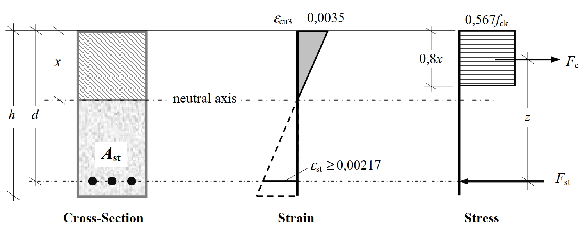

# Beams

## Design Procedure
### Analysis
1. Determine design life
2. Assess actions
3. Determine combinations of actions
4. Determine loading arrangements
### Design
1. Assess durability requirements and determine concrete strength
2. Check cover requirements for appropriate fire resistance period
3. Calculate min. cover for durability, fire and bond requirements
4. Analyse structure to obtain critical moments and shear forces
5. Desing flexural reinforcement
6. Design compression reinforcement if required
7. Check shear capacity     
8. Check torsion capacity
9. Check deflection
10. Check spacing of bars
11. Check crack control

## Flexural design

### Design Compressive strength
> EC2-1 - Eq 3.15

$$ f_{cd} = \alpha_{cc}f_{ck}/\gamma_{c} = 0.567f_{ck} $$

$ f_{cd}$ - Design compressive strength

$ \gamma_{Mc} $ - partial safety factor for concrete = 1.5

$ \alpha_{cc} $ - the coefficient taking account of long term effects on the compressive strength and of unfavourable effects resulting from the way the load is applied. default value = 0.85 in uk NA

### The Rectangular Stress Block

$\lambda $ - The percentage for reduction of the stress block. Value of $\lambda$ is dependent on the strength class of the concrete and is defined in
> EC2-1 - Clause 3.1.7(3)

$\varepsilon_{cu3}$ - Ultimate strain in the simplified stress-strain relationship in EC2 = 0.0035 for strength classes $\le$ C50/60

$\varepsilon_{st} = f_{yd}/E_s$

$d$ - *effective depth* - dimension from the extreme compression face to the centroid of the tensile force

Compression area height ($x$) should be limited to $0.45d$ to ensure yielding of steel first

Lever arm ($z$) should be limited to $0.95d$ to limit maximum strain in reinforcement to a value of 0.025 and avoids the reliance on any poor-quality concrete on top of the beam

$K'$ is used to limit the neutral axis depth. it is given as an absolute value, given as a function of the amount of redistribution of momements assumed, and is dependent on the concrete strength classes.

### Doubly reinforced sections

Moment about the line of action of $F_{st}$:

$M = (F_{c} \times z) + (F_{sc}\times(d-d_{2})) $

$F_{c}$ - the concrete compression capacity

$F_{sc}$ - the compression steel capacity

$d_{2}$ - the distance to the steel centroid from the top of concrete fibre.

## Crack control
> EC2-1 - Clause 7.3.2

This is where the mid-height reinforcement in beams come from. There is a spacing limitation